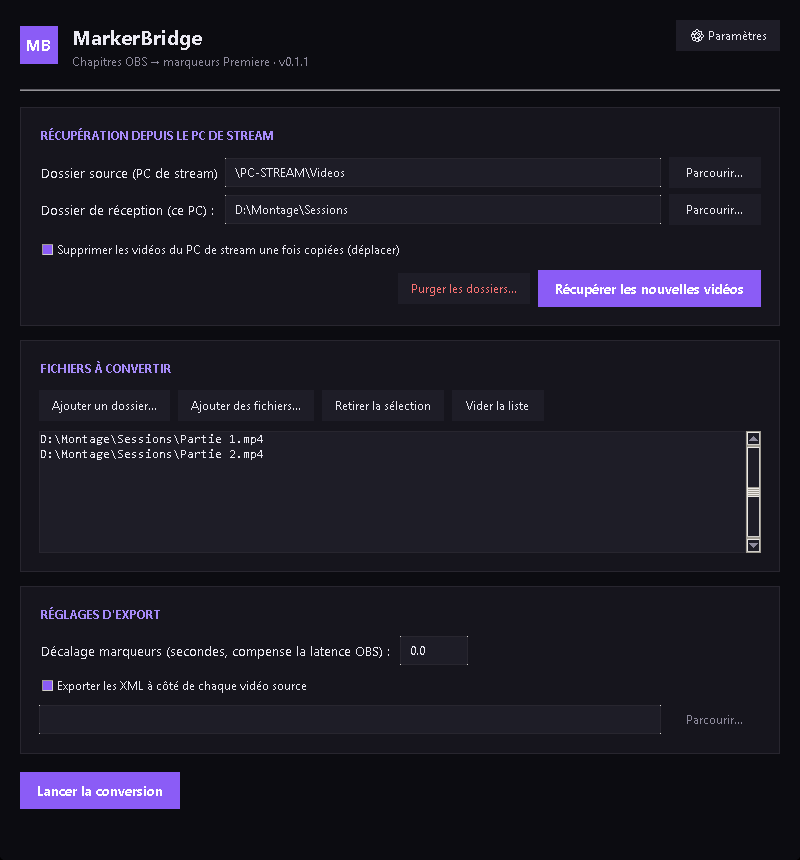

<div align="center">

# MarkerBridge

**Bridge your OBS chapter markers straight into Adobe Premiere Pro.**
**Fait le pont entre vos chapitres OBS et Adobe Premiere Pro.**




**[English](#english)** · **[Français](#français)**

</div>

---

## English

### What it does

If you record with OBS and edit in Adobe Premiere Pro, you've probably added
**chapter markers** while streaming/recording (the "add chapter" hotkey in OBS
30.2+) — and then had no easy way to get them into your Premiere timeline.

**MarkerBridge** reads those chapter markers straight from the `.mp4` file
(via `ffprobe`) and exports a Premiere-ready **FCP7 XML** file. Import it,
drag the (invisible) generated clip onto a track above your real edited
footage, and your markers line up on the timeline — no video re-import, no
duplicated audio.

### Features

- 🎬 **Chapter → marker conversion**, frame-accurate, using the real
  detected framerate (including NTSC rates).
- 🖥️ **Clean dark GUI** (Tkinter, no extra dependencies) *or* a **CLI** for
  scripting / drag-and-drop.
- 📡 **Network retrieval**: pulls new recordings from a remote/streaming PC
  over a network share, with automatic retry on transient network errors.
- 🔤 **Configurable auto-rename** after retrieval — pick a preset naming rule
  or write your own template (`{n}`, `{date}`, `{heure}` placeholders).
- 🧹 **Purge tool** to clear out source/destination folders, with a
  double-confirmation safety gate (it's a destructive action).
- 🔒 **Single-instance guard** — won't let you accidentally open two windows
  at once.
- 🌐 **Portable across machines**: settings live in `%APPDATA%`, not next to
  the script, so it works the same regardless of where it's installed.
- 📦 **No external Python dependencies** — only `ffmpeg`/`ffprobe`, which the
  app can download automatically (portable build, one-time, offline after
  that).

### Requirements

- Windows + Python 3.9+ (with `tkinter`, included in standard installs).
- `ffprobe` (part of `ffmpeg`) — MarkerBridge offers to download a portable
  build automatically the first time if it's not found.

### Usage

**GUI** (recommended):

```
lancer_interface.bat
```

or directly:

```
python gui.py
```

**Command line**, one file or a whole folder of `.mp4`s:

```
python markerbridge.py "C:\path\to\video.mp4"
python markerbridge.py "C:\path\to\folder" --decalage 0
```

Or drag a `.mp4` file / folder onto `glisser_deposer_ici.bat`.

### Why an invisible generated clip?

Premiere's FCP7 XML import needs *some* clip to hang markers off — an
"empty markers" XML doesn't import anything visible. Embedding the real
video worked, but caused duplicated audio tracks on OBS files with multiple
native audio tracks (xmeml doesn't distinguish streams from channels).
MarkerBridge instead generates an invisible 0%-opacity "Color Matte" clip,
sized to match your video's real duration, carrying the markers. Drop it on
a track above your already-edited footage and you're done — no duplicated
media, ever.

### License

MIT — see [LICENSE](LICENSE).

---

## Français

### Ce que ça fait

Si vous enregistrez avec OBS et montez sur Adobe Premiere Pro, vous avez
sans doute posé des **chapitres** pendant le stream/l'enregistrement (le
raccourci "ajouter un chapitre" d'OBS 30.2+) — sans moyen simple de les
récupérer dans votre timeline Premiere.

**MarkerBridge** lit ces chapitres directement dans le fichier `.mp4` (via
`ffprobe`) et exporte un fichier **XML FCP7** prêt à importer dans Premiere.
Importez-le, glissez le clip généré (invisible) sur une piste au-dessus de
votre vraie vidéo déjà montée, et les marqueurs se retrouvent au bon endroit
sur la timeline — sans jamais réimporter la vidéo ni dupliquer l'audio.

### Fonctionnalités

- 🎬 **Conversion chapitres → marqueurs**, précise à la frame près, avec le
  vrai framerate détecté (y compris les cadences NTSC).
- 🖥️ **Interface graphique sombre et épurée** (Tkinter, zéro dépendance
  externe) *ou* une **ligne de commande** pour l'automatisation / le
  glisser-déposer.
- 📡 **Récupération réseau** : rapatrie les nouveaux enregistrements depuis
  un PC de stream distant via un partage réseau, avec reprise automatique
  sur erreur réseau transitoire.
- 🔤 **Renommage automatique configurable** après récupération — choisissez
  une règle prédéfinie ou écrivez la vôtre (espaces réservés `{n}`, `{date}`,
  `{heure}`).
- 🧹 **Outil de purge** pour vider les dossiers source/destination, avec
  double confirmation obligatoire (action irréversible).
- 🔒 **Verrou mono-instance** — impossible d'ouvrir deux fenêtres par
  mégarde.
- 🌐 **Portable d'un PC à l'autre** : les réglages vivent dans `%APPDATA%`,
  pas à côté du script, donc ça fonctionne pareil quel que soit l'endroit où
  c'est installé.
- 📦 **Aucune dépendance Python externe** — seul `ffmpeg`/`ffprobe` est
  nécessaire, et l'appli propose de le télécharger automatiquement (version
  portable, une seule fois, utilisable hors ligne ensuite).

### Prérequis

- Windows + Python 3.9+ (avec `tkinter`, inclus dans les installations
  standard).
- `ffprobe` (fourni avec `ffmpeg`) — MarkerBridge propose de télécharger une
  version portable automatiquement au premier lancement si absent.

### Utilisation

**Interface graphique** (recommandé) :

```
lancer_interface.bat
```

ou directement :

```
python gui.py
```

**Ligne de commande**, un fichier ou tout un dossier de `.mp4` :

```
python markerbridge.py "C:\chemin\vers\video.mp4"
python markerbridge.py "C:\chemin\vers\dossier" --decalage 0
```

Ou glissez un fichier `.mp4` / un dossier sur `glisser_deposer_ici.bat`.

### Pourquoi un clip généré invisible ?

L'import XML FCP7 de Premiere a besoin d'*un* clip pour accrocher les
marqueurs — un XML "marqueurs seuls" n'importe rien de visible. Embarquer la
vraie vidéo fonctionnait, mais dupliquait les pistes audio sur les fichiers
OBS multi-pistes (xmeml ne distingue pas flux et canaux). MarkerBridge génère
à la place un clip "Color Matte" invisible (opacité 0%), calé sur la durée
réelle de la vidéo, portant les marqueurs. Il suffit de le glisser sur une
piste au-dessus de votre montage déjà en place — jamais de média dupliqué.

### Licence

MIT — voir [LICENSE](LICENSE).
